# Machine Learning for Fraud Detection using Amazon SageMaker

In this workshop we use Amazon Sagemaker built-in algorithm to implement a credit card fraud detector.

# High Level Steps

This workshop is divided into three modules.

* **Module 1 : Log into AWS account**

In this module you will log in to the AWS account provided for the workshop.  If you are using
your own AWS account, you can skip this and start directly with Module 2. 

 

 Click to expand for detailed steps 

Login to AWS Console (https://dashboard.eventengine.run) using the details provided
    
   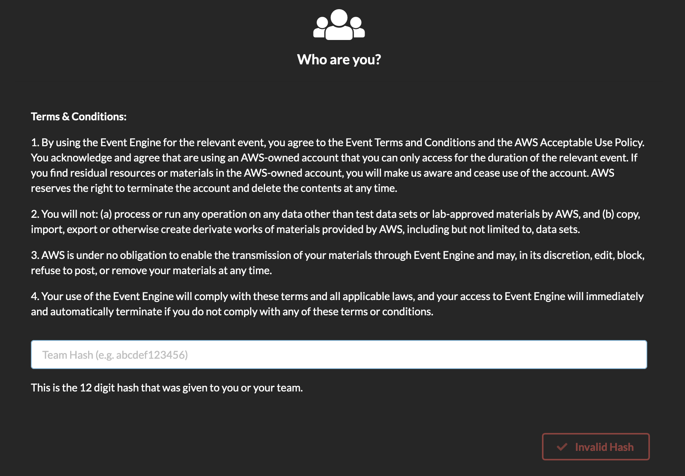
        
   Enter hash provided. Click "Accept Terms & Login"
        
   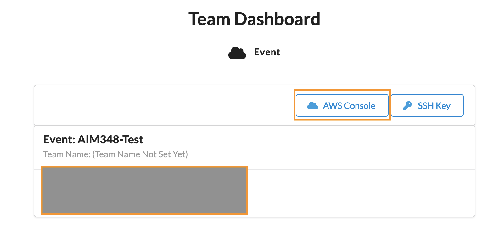 
        
   Click "AWS Console" 
        
   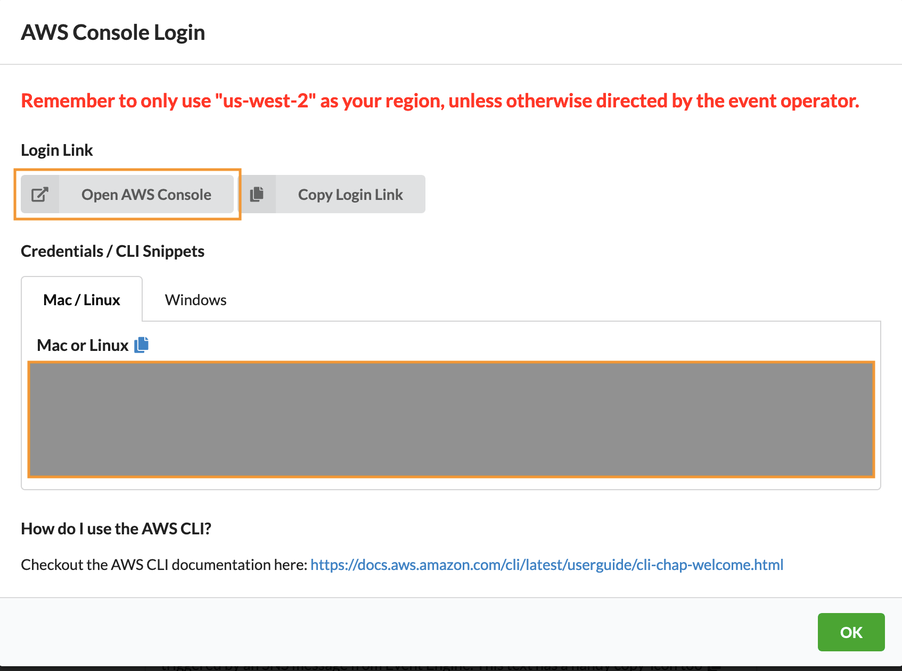 
        
   Select AWS Console
        
   You should be in the AWS Console
        
   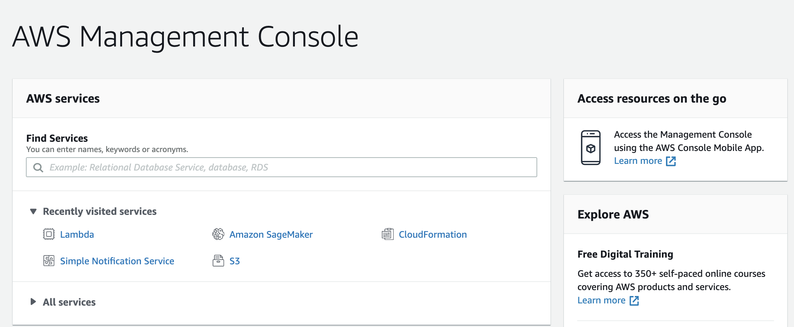 

* **Module 2 : Create a Amazon SageMaker Notebook instance**

 

 Click to expand for detailed steps 

   In the AWS Console, search for SageMaker  service.
   
   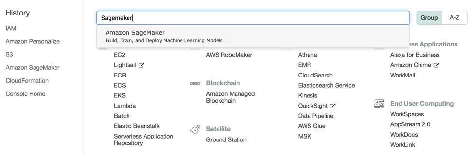 
   
   In the Amazon SageMaker console, click on the ‘Notebook instances’ from the navigation bar.
   
   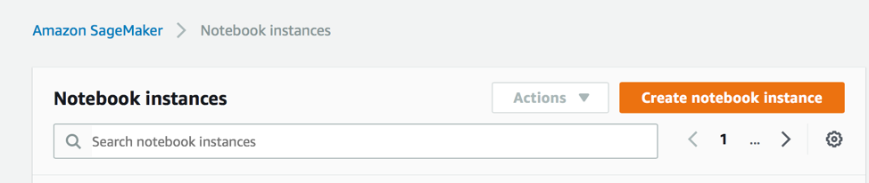
   
   Click ‘Create notebook instance’ 
   
   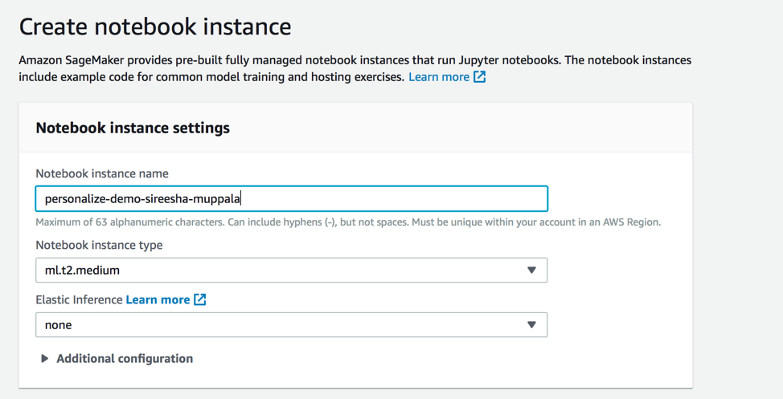
   
   In the notebook instance settings
   
   Enter a unique name for the notebook.

   Leave the default instance type.
   
   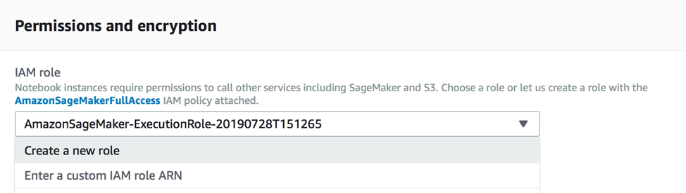
  
   In “Permissions and Encryption” section, for IAM Role, choose “Create a new role” from the dropdown.
  
    
   
   In the “Create an IAM role”, choose ‘Any S3 bucket’  and click ‘Create role’
   
   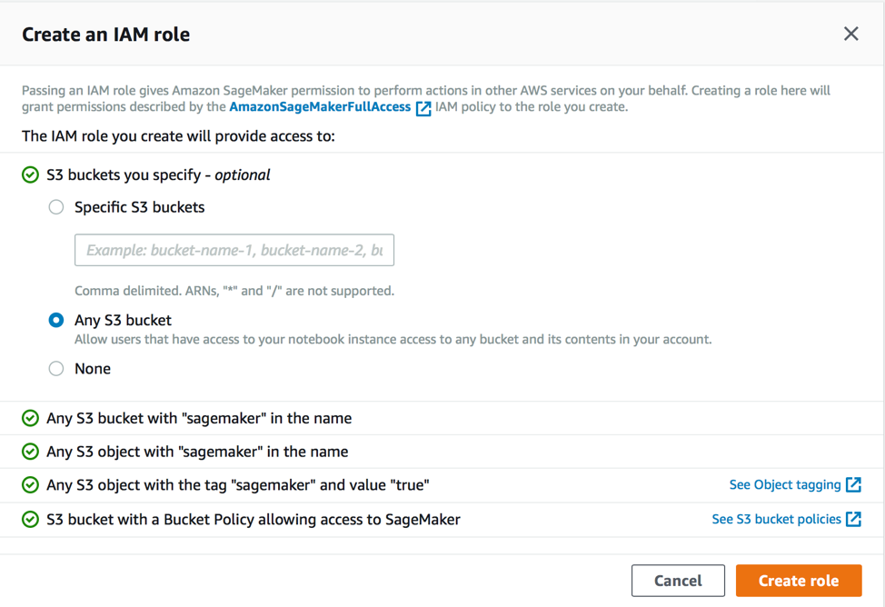  
   
   In the “Notebook Instance Settings” screen, click ‘Create notebook instance’.
   
   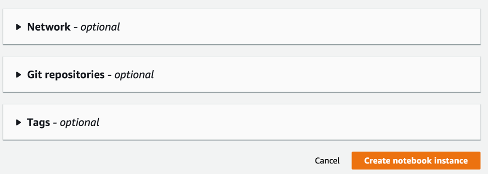   
   
   You will see notebook instance creation “In Progress”.
   
   Back in the Amazon SageMaker Notebook dashboard, verify that the notebook instance has been created.  This process will take 5-10 minutes to complete. 
   Once the status says InService, click "Open Jupyter"

   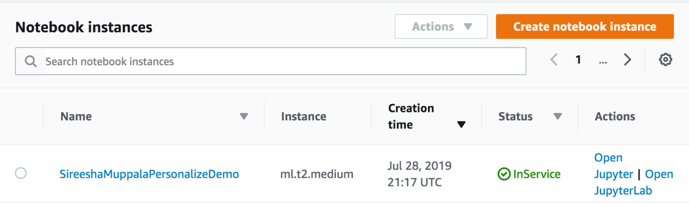
   
   Click Open Jupyter
   

   
   
* **Module 3 : Execute the fraud detection notebook cells.**   

 Click to expand for detailed steps 

   1. Download this git repository by either cloning the repository or downloading the *zip

   2. Upload the sagemaker_fraud_detection.ipynb to the Jupyter notebook.

   3. Click on the notebook to open and execute the cells.

